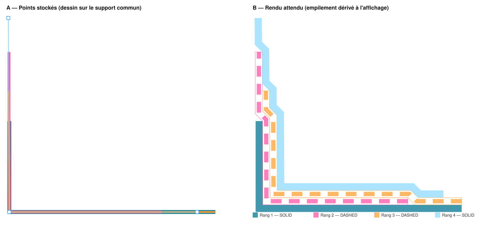

# Spec — Couches de matériaux (`isLayer`) sur les annotations STRIP

| | |
|---|---|
| **Feature** | Empilement de couches de matériaux pour les coupes de détail |
| **Domaine** | `annotations` (+ `mapEditor`, `mapEditorGeneric`, `geometry`, `form`, `panelDrawing`) |
| **Issue / branche** | #314 — `issue_314_material_layers` |
| **Statut** | Implémenté et validé (2026-08-29) |
| **Exemple de référence** | [`example-annotations.json`](example-annotations.json) → [`expected-render.svg`](expected-render.svg) |

> Cette spec sert d'exemple du format « spec-driven » du repo : le rendu attendu
> est **généré par l'implémentation réelle** via
> [`generateExpectedRender.js`](generateExpectedRender.js) — si l'algorithme
> change, on régénère le SVG et la spec reste la source de vérité visuelle.

---

## 1. Contexte & problème

Les coupes de détail (étanchéité, isolation, protection…) représentent des
couches de matériaux superposées le long d'un même support (relevé, acrotère,
plancher). Dessiner ces couches à la main est pénible : chaque couche doit être
décalée de l'épaisseur cumulée des couches sous-jacentes, les franchissements
d'arrêts de couches se font à 45°, et la moindre retouche d'une couche oblige à
tout redessiner.

## 2. Objectif

Dessiner chaque couche **directement sur la ligne support** (les polylignes des
couches sont colinéaires, le snap existant suffit), et laisser l'application
produire **au rendu** la superposition correcte : décalage d'épaisseur cumulée,
rampes à 45° au droit des arrêts de couches, ordre d'empilement contrôlable.

## 3. Scénarios utilisateur

1. **Dessiner une pile** — L'utilisateur arme l'outil STRIP avec le toggle
   « Couche » (draft), dessine 4 strips sur la même ligne support (snap
   PROJECTION/VERTEX). À chaque commit, la couche s'affiche empilée sur les
   précédentes, dans l'ordre de dessin. ✅ *Critère : aucune retouche manuelle
   des points ; le rendu correspond au panneau B du SVG de référence.*
2. **Éditer une couche** — L'utilisateur sélectionne une couche : elle
   « retombe » visuellement sur le support, ses poignées de sommets sont sur la
   ligne support ; il déplace un sommet ; à la désélection la pile entière se
   recalcule. ✅ *Critère : les points stockés restent colinéaires au support.*
3. **Réordonner** — Dans le panneau de propriétés, le switch « Couche » expose
   des flèches monter/descendre qui changent le rang de la couche dans la pile.
   ✅ *Critère : le rendu se réempile immédiatement.*
4. **Symbole membrane** — L'utilisateur passe le contour d'une couche en
   « Pointillés » : la bande se rend en symbole membrane (bande blanche +
   blocs colorés), et il règle Longueur/Espacement des blocs dans la section
   « Bandes colorées » du popover d'épaisseur du contour. ✅ *Critère : les
   blocs suivent les coins et les rampes de la géométrie empilée.*

## 4. Exigences fonctionnelles

- **FR-1** — Nouvelle propriété booléenne `isLayer` sur les annotations
  `type === "STRIP"`, éditable par annotation (switch « Couche », pattern
  `FieldAnnotationIsExt`) et armable avant dessin dans la toolbar de draft
  (mémorisée par template via `REMEMBERABLE_DRAFT_KEYS`).
- **FR-2** — Ordre d'empilement : champ `layerIndex` en **fractional index**
  (`generateKeyBetween`, lib déjà utilisée pour `orderIndex`), assigné au
  commit (après la dernière couche du baseMap) ou au toggle ON ; tri de
  secours par `createdAt` puis `id`. Réordonnancement par re-mint complet des
  clés du baseMap (`buildReorderUpdates`).
- **FR-3** — Les points stockés **ne sont jamais réécrits** : l'empilement est
  une géométrie dérivée, calculée à l'affichage (voir §6).
- **FR-4** — Couche N : bord déplacé de `d(s) = Σ épaisseurs` des couches
  sous-jacentes couvrant l'abscisse curviligne `s` (couverture = segments
  quasi-colinéaires au support, tolérance = ½ épaisseur clampée 2–24 px,
  garde-fou de parallélisme `sin ≤ 0.3` — les supports réels dérivent de
  quelques px). La couche de rang 1 reste telle que dessinée.
- **FR-5** — Rampes à **45°** au droit de chaque arrêt de couche, placées côté
  bas, pleine hauteur atteinte au bord de la couche inférieure ; les rampes
  des couches supérieures sont décalées de l'« avance de miter »
  `t·(√2−1)` par bande continue au-dessus de la couche qui s'arrête (§6.3).
- **FR-6** — Côté de la pile = côté de la bande de la strip (sens de dessin ×
  `stripOrientation`) ; le bouton flip existant inverse.
- **FR-7** — Au commit d'une couche, le snap PROJECTION **n'insère pas** de
  sommet partagé dans la strip support (pas de pollution) ; le partage de
  points sur snap VERTEX est conservé (colinéarité exacte).
- **FR-8** — Strips `strokeType === "DASHED"` : rendu « membrane » (bande
  blanche, liseré, blocs colorés le long de l'axe), paramétré par
  `dashLength` / `dashGap` (unité = `strokeWidthUnit`, défauts
  `STRIP_DASH_DEFAULTS = { dashLength: 15, dashGap: 10 }`), éditables au
  niveau annotation et template (couverts par le cadenas global du contour).
- **FR-9** — Quantités, cotes, 3D, DXF, snap : inchangés, mesurés sur le
  **support** (invariants, §6.6).

## 5. Modèle de données

Aucun changement de schéma Dexie (champs non indexés) ; les zips Krto
transportent les nouveaux champs automatiquement (filtre par ligne).

```js
// db.annotations — new fields on STRIP rows
{
  isLayer: true,          // participates in the layer stack of its baseMap
  layerIndex: "a2",       // fractional index (stack order, bottom → top)
  dashLength: 15,         // DASHED strips: colored block length (strokeWidthUnit)
  dashGap: 10,            // DASHED strips: gap between blocks (strokeWidthUnit)
}
// db.points — UNCHANGED: stored points stay on the shared support line
```

## 6. Impacts sur le rendu — mécanisme d'empilement

**C'est le cœur de la feature.** Le principe : *stockage = support, affichage =
pile*, avec une couture render-only qui n'altère ni l'interaction ni les
quantités.

### 6.1 Couture render-only (`displayAnnotations`)

Dans `MainMapEditorV3.jsx`, un memo dédié transforme le tableau d'annotations
**uniquement pour les consommateurs d'affichage** :

```js
// MainMapEditorV3 — render-only seam. The raw `annotations` array keeps
// feeding InteractionLayer (snap), EditedObjectLayer (selected), drags and
// commit paths; only the display consumers get the stacked geometry.
const displayAnnotations = useMemo(() => {
    const stackedById = applyLayerStackingToAnnotations(annotations, {
        baseMapId: baseMap?.id,
        meterByPx: baseMap?.getMeterByPx?.(),
    });
    if (!stackedById?.size) return annotations;
    return annotations.map((a) =>
        stackedById.has(a.id)
            ? { ...a, points: stackedById.get(a.id), _layerSupportPoints: a.points, _layerStacked: true }
            : a
    );
}, [annotations, baseMap?.id]);
```

Branché sur exactement **trois** consommateurs : `StaticMapContent` (rendu),
`PrintableMap` (export rapide), `useImageModeLabelsLayout` (étiquettes de
capture). Conséquences obtenues gratuitement :

- l'annotation **sélectionnée** n'est pas rendue par `StaticMapContent` mais
  par `EditedObjectLayer`, qui reçoit le tableau **brut** → l'édition (poignées,
  drags) opère sur le support ; à la désélection la couche se réempile ;
- le **snap** de dessin vise le support (voulu : on dessine les couches sur la
  même ligne) ;
- le hit-testing DOM (`data-node-type`) fonctionne sur la géométrie affichée
  (cliquer une bande décalée sélectionne la bonne annotation).

`_layerStacked` désactive les outils par-segment (`selectMode`) sur les lignes
empilées : les rampes insérées décalent les index de segments.

### 6.2 Pipeline géométrique (par couche, ordre `layerIndex`)

`applyLayerStackingToAnnotations` (orchestrateur, `annotations/utils`) →
`getLayerStackProfile` + `offsetPolylineVariable` (utils purs, `geometry/utils`,
rejouables en node) :

```
support points (stored, colinear)
  │  1. coverage intervals per underlying layer
  │     — both endpoints of a segment within tol of the support line
  │       (tol = clamp(thickness/2, 2, 24 px)), near-parallel only (sin ≤ 0.3)
  ▼
base step function d(s) = Σ thicknessPx of covering underliers
  │  2. one 45° "wedge" per step + flat cap up to the shifted anchor (§6.3)
  ▼
D(s) = max-envelope(base, wedges)     // resolves clipped/chained ramps exactly
  │  3. variable-distance parallel offset, left-normal (-uy, ux) × stripOrientation
  │     — miter at original vertices, ids preserved, inserted ramp stations
  ▼
stacked display points (+ removeLocalLoops: corner-cut junctions,
                        collapseSpikes: collinear back-and-forth)
```

L'enveloppe max règle exactement les cas retors : rampe plus longue que le
tronçon bas (clippée), escaliers rapprochés (chaînés en une seule pente 45°),
marche au bord du domaine (saut vertical).

### 6.3 Rampes 45° et avance de miter

Le contour **supérieur** d'une bande qui plie à 45° avance de `t·(√2−1)` au
pli (joints mitrés). Chaque bande qui continue **au-dessus** de la couche qui
s'arrête décale donc d'autant les rampes des couches qui la chevauchent —
sinon toutes les rampes s'ancrent à la même station et les bandes se
recouvrent :

```js
// getLayerStackProfile — wedge anchor shift at a coverage boundary b
const MITER_ADVANCE = Math.SQRT2 - 1;
// sum the thicknesses of underliers that SPAN b and sit ABOVE the ending one
shift = MITER_ADVANCE * sumOfContinuingThicknessesAbove(b);
```

### 6.4 Construction de la bande (quad-union)

Une STRIP stocke **un bord** de la bande ; la bande s'étend de toute la
largeur côté `stripOrientation`. La géométrie empilée crée des jonctions
concaves dont le segment adjacent est plus court que la largeur (rampe coupée
par la remontée après un coin) : le ruban « aller-retour » historique s'y
auto-croisait. `offsetPolylineAsPolygons` construit désormais la bande comme
l'**union de quads par segment + coins de jonction** (miter plafonné au ratio
2, biseau au-delà) — identique sur les tracés sains, robuste sur les jonctions
dégénérées, un seul polygone connexe.

### 6.5 Rendu membrane (strips DASHED)

`NodeStripStatic`, quand `strokeType === "DASHED"` :

```jsx
// white band + thin outline, then colored dash blocks stroked along the
// band CENTERLINE (edge offset by half the width), clipped to the band
<path d={band} fill="#fff" stroke={strokeColor} vectorEffect="non-scaling-stroke"/>
<g clipPath={bandClip}>
  <path d={centerline} stroke={strokeColor}
        strokeWidth={bandWidthPx * 0.6}
        strokeDasharray={`${dashPx} ${gapPx}`} strokeLinecap="butt"/>
</g>
```

Les blocs suivent les coins et les rampes puisque le rendu part des points
**affichés** (empilés). Conversion px identique à la largeur de bande
(`CM → v·0.01/meterByPx`).

### 6.6 Invariants (ce qui ne change PAS)

- `db.points` : jamais réécrits ; la colinéarité des supports est préservée.
- Quantités (`getAnnotationQties`), cotes de segments, 3D, DXF, portfolio :
  calculés en amont de la couture, sur le support — la quantité d'un matériau
  se mesure le long de son support.
- Snap, drags, `TransientTopologyLayer` : géométrie brute (pendant un drag les
  couches retombent visuellement sur le support, puis se réempilent).

## 7. Exemple de référence

Entrée : [`example-annotations.json`](example-annotations.json) — 4 strips
de 10 cm (`t ≈ 47.96 px` à `meterByPx = 0.0020849`), dessinées sur le même
support en L (sol + mur), rangs `a0..a3`, dérives réelles conservées (la
verticale rose est à 2,15 px de la teal ; la « verticale » de la couche 4
penche de 6,6 px sur sa hauteur — la tolérance de couverture doit les
absorber).

Rendu attendu (généré par l'implémentation — régénérable, voir §9) :



Attentes chiffrées (extraits, tolérance ±4 px — reprises dans le replay) :

| Où | Attendu |
|---|---|
| Rang 1 (teal) | identique aux points stockés |
| Rang 2 (rose), mur y=1000 | bord à `x_support(y) + t` (posé sur la teal) |
| Rang 2 (rose), mur y=500 | retour sur son support (au-dessus du sommet teal, rampe 45°) |
| Rang 4 (bleu), sol x=−1000 | bord à `y_support − 3t` |
| Rang 4 (bleu), mur y=1000 / 500 / 100 | `+2t` / `+t` / support (deux décrochés 45°) |
| Rang 4 (bleu), mur y=725 | encore à `+2t` : rampe décalée de `t(√2−1)` après le sommet teal |

## 8. Cas limites & limitations (v1)

- Couche avec arcs (`type: "circle"`), `closeLine` ou `hiddenSegmentsIdx` non
  vide → rendue **non empilée** (les rampes insérées casseraient les index de
  segments et les triplets S-C-S).
- Les segments cachés d'une couche **sous-jacente** ne comptent pas dans
  l'épaisseur (couverture par chunks visibles).
- 3D, DXF, cotes : géométrie support (non empilée) en v1.
- Cuts (soustractions) sur une couche : non suivis du décalage — déconseillé.
- Couche masquée par listing : filtrée en amont → n'occupe plus d'épaisseur.
- Les couches doivent être dessinées dans le même sens (côté de pile =
  normale du sens de dessin × `stripOrientation`).

## 9. Vérification

```bash
# Deterministic replay of the stacking math (31 checks, exits 1 on failure):
node_modules/.bin/esbuild scripts/replay/layerStackingReplay.js --bundle --format=esm --platform=node --alias:Features=./src/Features --alias:App=./src/App --outfile=/tmp/layerReplay.mjs && node /tmp/layerReplay.mjs
```

```bash
# Regenerate the expected render of this spec from the real implementation:
node_modules/.bin/esbuild specs/annotations/material-layers-strip/generateExpectedRender.js --bundle --format=esm --platform=node --alias:Features=./src/Features --alias:App=./src/App --outfile=/tmp/specRender.mjs && node /tmp/specRender.mjs
```

Le replay couvre : l'exemple idéalisé 4 couches, l'exemple **réel** (dérives),
couverture antiparallèle, escaliers, gaps, tolérances (10 px couvre / 30 px
non / quasi-perpendiculaire non), skip arcs/fermées, bande d'un seul tenant,
rampe décalée, helpers d'ordre fractional. + `npm run lint`, `npm run build` ;
validation visuelle par l'utilisateur.

## 10. Fichiers impactés

| Rôle | Fichiers |
|---|---|
| Utils purs (géométrie) | `geometry/utils/getLayerStackProfile.js`, `offsetPolylineVariable.js`, `offsetPolylineAsPolygon.js` (`offsetPolylineAsPolygons`), `getStripePolygons.js` (`STRIP_DASH_DEFAULTS`, lobes multiples) |
| Orchestrateur & ordre | `annotations/utils/applyLayerStackingToAnnotations.js`, `layerStackOrder.js` |
| Couture rendu | `mapEditor/components/MainMapEditorV3.jsx` (memo `displayAnnotations`), `StaticMapContent.jsx` (garde `selectMode`) |
| Renderer | `mapEditorGeneric/components/NodeStripStatic.jsx` (membrane DASHED) |
| UI | `annotations/components/FieldAnnotationIsLayer.jsx`, `SectionAnnotationPropertiesContent.jsx`, `form/components/FieldStrokeCompact.jsx` (section « Bandes colorées »), `mapEditor/components/ToolbarDrawingDraft.jsx`, `mapEditor/utils/getDraftFieldVisibility.js` |
| Commit | `mapEditor/hooks/useHandleCommitDrawing.js` (layerIndex, garde snap-insertion) |
| Plomberie | `getAnnotationTemplateProps.js`, `drawingShapeConfig.js`, `getNewAnnotationPropsFromAnnotationTemplate.js`, `buildImportData.js`, `saveMeshService.js`, `convertStripPolyline.js`, hooks smartDetect, `createContourAnnotationsService.js` |
| Tests | `scripts/replay/layerStackingReplay.js` |
